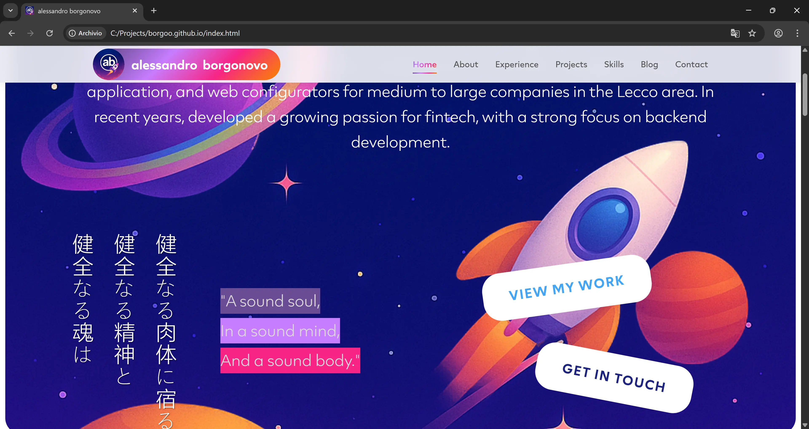

# Alessandro Borgonovo - Portfolio Website

Welcome to my personal space on the web! This is where I showcase my journey as a software engineer, featuring projects, experience, and a bit of my personality.

### [Go to website](https://borgoo.github.io/)



## About This Site

This portfolio website represents my professional journey in software development, with a focus on fintech and full-stack solutions. Built with clean HTML, CSS, and JavaScript, it features an engaging space-themed design that reflects my passion for technology and innovation.

**NEW**: Now featuring an integrated blog where I share insights, learning experiences, and technical explorations.

## What You'll Find Here

- **Professional Experience**: Over 6 years of software development experience
- **Featured Projects**: From massive PDF generation platforms to mobile apps serving 100K+ users
- **Technical Skills**: Backend development with C# and .NET, frontend with React and Angular, plus various databases and tools
- **Blog**: Technical writings and learning journey documentation ([Ez Blog 2.0](https://github.com/borgoo/ez-blog-2))
- **Contact Information**: Ready to discuss new opportunities and collaborations

## Technologies Used

- HTML5 & CSS3
- Vanilla JavaScript
- Font Awesome icons
- Custom SVG animations
- Responsive design principles
- Dark/Light theme support (blog)

## Project Structure

```
borgoo.github.io/
├── assets/          # All static assets (CSS, JS, fonts, images)
│   ├── css/         # Stylesheets (main, fonts, header-logo)
│   ├── js/          # JavaScript files (main)
│   ├── images/      # Images and icons
│   └── fonts/       # Custom font files
├── blog/            # Ez Blog 2.0 - Technical blog
│   ├── buildable-drafts/  # Source files (drafts, not versioned)
│   ├── posts/       # Generated static pages
│   ├── css/         # Blog stylesheets
│   ├── js/          # Blog JavaScript and build scripts
│   ├── build.js     # Main build script
│   └── index.html   # Generated blog homepage
└── index.html       # Main portfolio page
```

## Features

### Portfolio Website
- Space-themed interactive design
- Smooth scrolling navigation
- Responsive layout for all devices
- Project showcase with detailed descriptions
- Professional experience timeline

### Ez Blog 2.0
- Clean, minimalist blog design
- Dark/Light theme switcher
- Static site generation (GitHub Pages compatible)
- Responsive reading experience

## Getting Started

Simply open `index.html` in your browser to explore the portfolio, or visit `/blog/` for the blog section. The entire site is fully responsive and includes smooth scrolling navigation and interactive elements.

## Blog

Visit the [blog section](https://borgoo.github.io/blog/) to read about:
- Software development insights
- Learning experiences and challenges
- Technical explorations and experiments
- Coding practices and problem-solving

The blog is built with [Ez Blog 2.0](https://github.com/borgoo/ez-blog-2), a lightweight static blog system designed for simplicity and performance.

## Contact

Feel free to reach out if you'd like to discuss potential collaborations or just want to chat about software development:

- Email: alessandro.borgonovo.info@gmail.com
- LinkedIn: [alessandro-borgonovo](https://linkedin.com/in/alessandro-borgonovo-9754161b6)
- GitHub: [borgoo](https://github.com/borgoo)

---

*"A sound soul, in a sound mind, and a sound body."* - The philosophy that guides both my personal and professional life.
